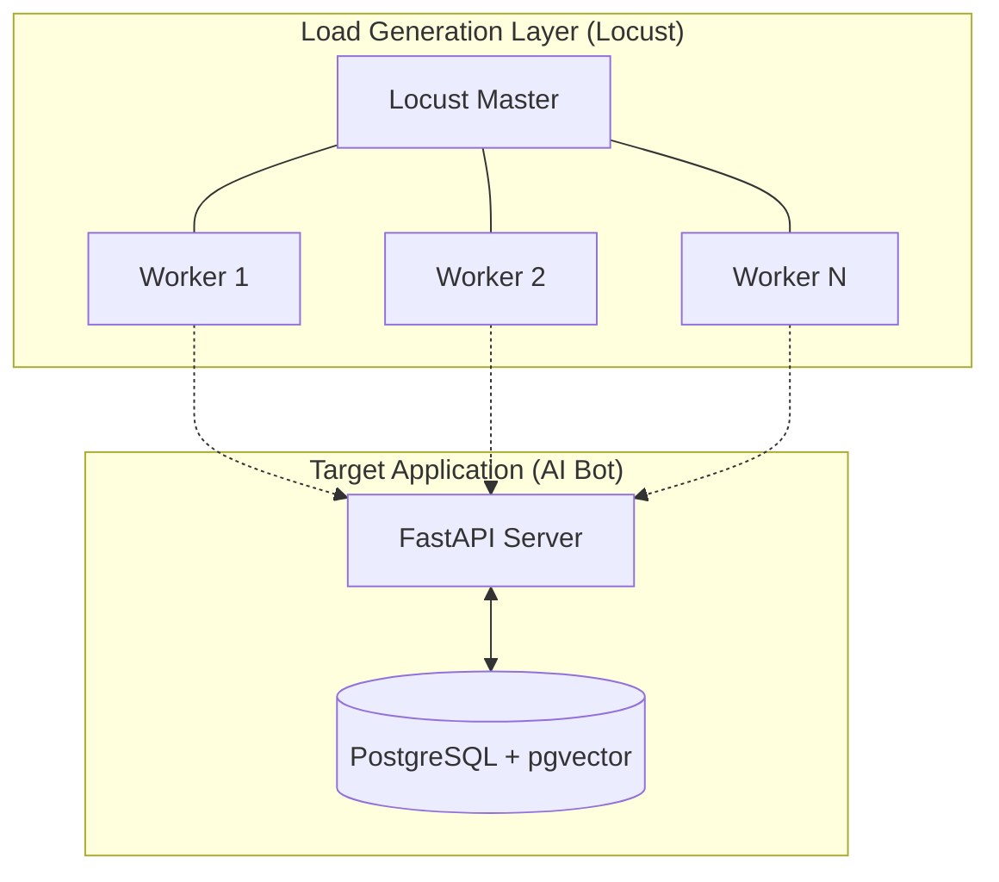

# 🧠 AI Load Tester: Distributed Reliability Testing for Conversational Agents

**AI Load Tester** is a high-performance, distributed framework designed to evaluate the reliability and scalability of AI-driven conversational bots. By simulating complex, stateful user interactions and performing real-time semantic validation, it ensures your AI assistant stays helpful and accurate under massive load.

---

## 🏗 System Architecture

The project utilizes a modern, distributed stack to achieve high throughput and precise evaluation:



1.  **PostgreSQL (pgvector)**: A high-performance knowledge base using vector search for semantic retrieval.
2.  **AI Bank Bot (FastAPI)**: A mock assistant that generates responses by querying the knowledge base with embeddings.
3.  **Locust Master**: Coordinates tests and provides a real-time monitoring dashboard.
4.  **Locust Workers**: Independent nodes that simulate thousands of virtual users following YAML scenarios.

---

## ✨ Key Features

-   **🎯 Semantic Validation**: Uses `sentence-transformers` and `FastEmbed` to score bot responses based on intent similarity, not just exact keyword matches.
-   **📈 Distributed Scaling**: Easily scale from 1 to 1,000+ RPS by adding more Locust worker containers.
-   **🤖 Persona Simulation**: Native support for different "user personas" (Hurried, Detailed, Standard) with tunable response delays and behaviors.
-   **🔄 Stateful Scenarios**: Define complex user-AI interaction flows using a YAML-based state-machine logic.
-   **⚡ Vector-First Retrieval**: The target bot uses `pgvector` for state-of-the-art semantic search across its knowledge base.

---

## 🚀 Quick Start (Production Setup)

The entire stack is containerized for seamless deployment.

### 1. Prerequisites
- Docker & Docker Compose
- 4GB+ RAM (preferred for vector embeddings)

### 2. Launch the Stack
```bash
# Start all services (Database, Bot, Locust Master, & 1 Worker)
docker compose up -d

# Scale out testing capacity (e.g., to 5 workers)
docker compose up -d --scale locust-worker=5
```

### 3. Access Dashboards
-   **Locust Web UI**: [http://localhost:8089](http://localhost:8089)
-   **AI Bot Status**: [http://localhost:8000/docs](http://localhost:8000/docs)
-   **PostgreSQL**: `localhost:5432`

---

## 🛠 Project Structure

| Directory | Description |
| :--- | :--- |
| `core/` | Core engine including `VirtualUser` logic and communication protocols. |
| `brain/` | AI-driven semantic similarity validator and embedding logic. |
| `scenarios/` | YAML-based test scenarios and state machine definitions. |
| `db_manager/` | Database schemas, models (SQLAlchemy), and session handling. |
| `docs/` | Deep-dive documentation on architecture, scenarios, and API. |
| `main.py` | The target FastAPI application (the AI Bot). |
| `locustfile.py` | Load generator entry point. |

---

## 📝 Configuration

Configuration is managed via environment variables in `docker-compose.yml`:

| Variable | Description | Default |
| :--- | :--- | :--- |
| `DATABASE_URL` | PostgreSQL connection string | `postgresql://user:password@db:5432/faq_db` |
| `TARGET_URL` | The endpoint of the bot being tested | `http://bank-bot:8000` |
| `SCENARIO_PATH` | Path to the active YAML scenario | `scenarios/example.yaml` |

---

## 📚 Deep Dives

-   [Architecture Overview](docs/architecture.md)
-   [Scenario Development Guide](docs/scenarios.md)
-   [API Reference](docs/api-reference.md)

---
Built for high-performance AI reliability testing.
