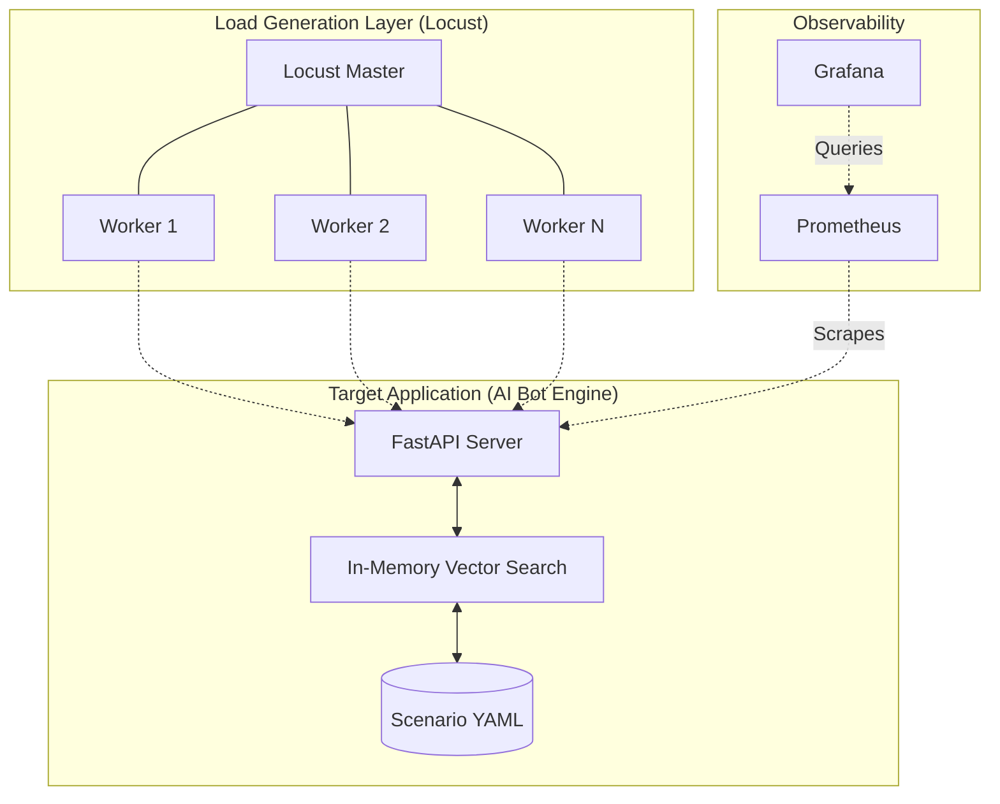

# 🧠 AI Load Tester: Distributed Reliability Testing for Conversational Agents

**AI Load Tester** is a high-performance, distributed framework designed to evaluate the reliability and scalability of AI-driven conversational bots. By simulating complex, stateful user interactions and performing real-time semantic validation, it ensures your AI assistant stays helpful and accurate under massive load.

---

## 🏗 System Architecture

The project utilizes a modern, distributed stack with in-memory semantic indexing for maximum throughput:



1.  **AI Bot Engine (FastAPI)**: A stateful assistant that manages user sessions and drives dialogue based on YAML scenarios.
2.  **In-Memory Vector Search & Cache**: Uses `FastEmbed` and `NumPy` for lightning-fast semantic matching of user intents without external database overhead, enhanced by a built-in embedding cache.
3.  **Locust Master**: Coordinates tests and provides a real-time monitoring dashboard.
4.  **Locust Workers**: Independent nodes that simulate thousands of virtual users following YAML scenarios.

---

## ✨ Key Features

-   **🎯 Semantic Matching**: Uses `FastEmbed` and `NumPy` matrix operations to match user input to the correct dialogue state with high precision.
-   **🚀 Embedding Caching**: In-memory caching of semantic embeddings to drastically reduce latency and CPU load for repeated queries.
-   **📈 Distributed Scaling**: Easily scale from 1 to 10,000+ concurrent users by adding more Locust worker containers.
-   **📊 NLP Quality Metrics**: Real-time tracking of Precision, Recall, and Embedding Cache Hit Ratio via Prometheus and Grafana.
-   **🤖 Stateful Bot Engine**: Native support for complex, multi-turn conversations with session management via `X-Session-ID`.
-   **🔄 YAML-Driven Logic**: Define both the bot's behavior and the test scenarios in simple YAML files.
-   **⚡ High Performance**: No database bottlenecks; all vector indexing and state management happens in-memory for minimal latency.

---

## 🚀 Quick Start

The entire stack is containerized for seamless deployment.

### 1. Prerequisites
- Docker & Docker Compose
- 2GB+ RAM (for vector embeddings)

### 2. Launch the Stack
```bash
# Start the Bot and Locust Master
docker compose up -d

# Scale out testing capacity (e.g., to 5 workers)
docker compose up -d --scale locust=5
```

### 3. Access Dashboards
-   **Locust Web UI**: [http://localhost:8089](http://localhost:8089)
-   **AI Bot Status**: [http://localhost:8000/docs](http://localhost:8000/docs)
-   **Grafana Dashboards**: [http://localhost:3000](http://localhost:3000)
-   **Prometheus Targets**: [http://localhost:9090/targets](http://localhost:9090/targets)

---

## 🛠 Project Structure

| Directory | Description |
| :--- | :--- |
| `core/` | Core engine including `VirtualUser` logic and communication protocols. |
| `brain/` | Semantic similarity validator and embedding logic. |
| `scenarios/` | YAML-based test scenarios and state machine definitions. |
| `grafana/` | Grafana dashboard JSON models and configurations. |
| `prometheus/` | Prometheus scraping configurations. |
| `docs/` | Deep-dive documentation on architecture, scenarios, and API. |
| `main.py` | The target FastAPI application (the Stateful Bot Engine). |
| `locustfile.py` | Load generator entry point. |

---

## 📝 Configuration

Configuration is managed via environment variables and volumes:

| Variable | Description | Default |
| :--- | :--- | :--- |
| `TARGET_URL` | The endpoint of the bot being tested | `http://bank-bot:8000` |
| `SCENARIO_PATH` | Path to the active YAML scenario | `scenarios/example.yaml` |

---

## 📚 Deep Dives

-   [Architecture Overview](docs/architecture.md)
-   [Scenario Development Guide](docs/scenarios.md)
-   [API Reference](docs/api-reference.md)
-   [Monitoring & Observability](docs/monitoring.md)

---
Built for high-performance AI reliability testing.
